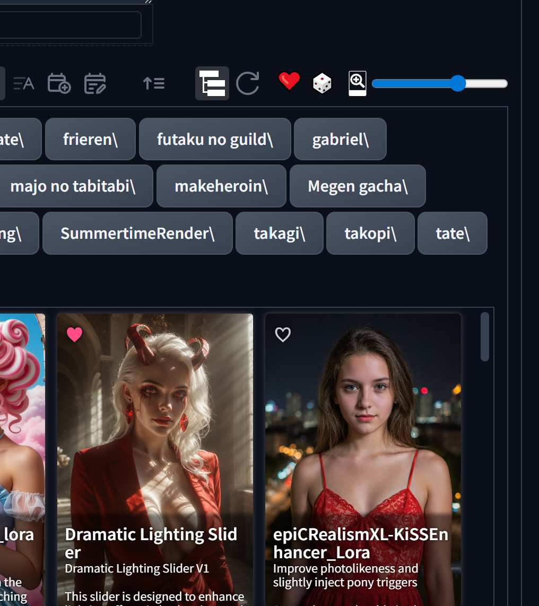

# Forge Card Favorites

Small Stable Diffusion WebUI Forge extension that adds favorite toggles to Extra
Networks cards.



## Features

- Adds a heart button to Extra Networks cards
- Adds a Favorites Only filter button to Extra Networks controls
- Stores favorites in the extension data folder so they can be shared by
  browsers that open the same Forge install
- Migrates older browser-only favorites from `localStorage` on first load
- Keeps `localStorage` as a browser backup/fallback if the backend route is not
  available yet
- No Python package dependencies and no startup installer

## Install

Clone or copy this folder into:

```text
webui/extensions/forge-card-favorites
```

Then restart Forge.

## Notes

- Favorites are saved to `data/favorites.json` inside this extension folder.
- The `data/` folder is ignored by git because it is user data.
- After installing or updating, restart Forge once so the backend route is
  registered.
